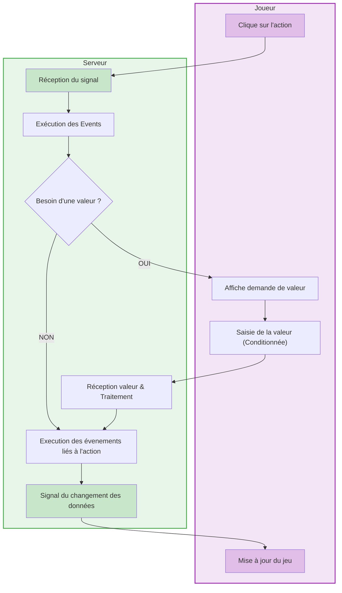

# InsertedValue Event

```mermaid
flowchart TB
 subgraph JOUEUR["Joueur"]
        A@{ label: "Clique sur l'action" }
        F["Saisie de la valeur (Conditionnée)"]
        E_Display["Affiche demande de valeur"]
        I["Mise à jour du jeu"]
  end
 subgraph SERVEUR["Serveur"]
        B["Réception du signal"]
        C["Exécution des Events"]
        D@{ label: "Besoin d'une valeur ?" }
        G["Réception valeur & Traitement"]
        J["Execution des évenements liés à l'action" ]

        K["Signal du changement des données" ]
  end
    A --> B
    B --> C
    C --> D
    D -- OUI --> E_Display
    E_Display --> F
    F --> G
    G --> J
    J --> K
    K --> I
    D -- NON --> J

    A@{ shape: rect}
    D@{ shape: diamond}
    J@{ shape: rect}
    style A fill:#E1BEE7
    style I fill:#E1BEE7
    style B fill:#C8E6C9
    style K fill:#C8E6C9
    style JOUEUR fill:#f3e5f5,stroke:#9c27b0,stroke-width:2px
    style SERVEUR fill:#e8f5e9,stroke:#4caf50,stroke-width:2px


```