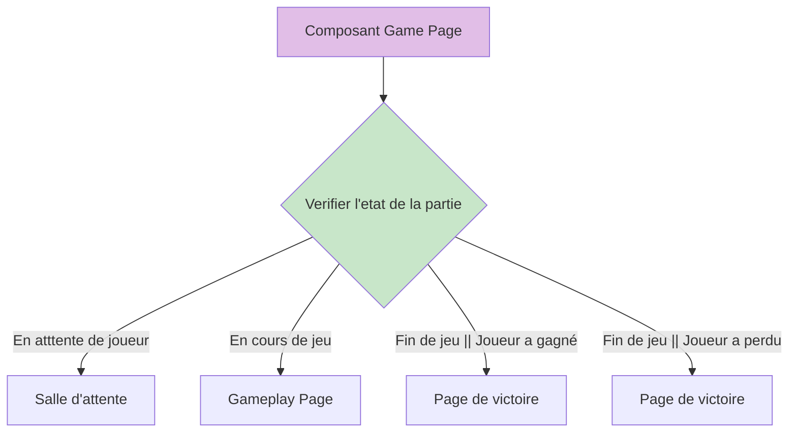

# Game Page Affichage

```mermaid
flowchart TB
    A["Composant Game Page"] --> B@{ label: "Verifier l'etat de la partie" }
  
    B -- En atttente de joueur --> D@{ label: "Salle d'attente" }
    B -- En cours de jeu --> E["Gameplay Page"]
    B -- Fin de jeu || Joueur a gagné --> G["Page de victoire"] 
    B -- Fin de jeu || Joueur a perdu --> C["Page de victoire"] 

    B@{ shape: diamond}
    D@{ shape: rect}
    style A fill:#E1BEE7
    style B fill:#C8E6C9 
```