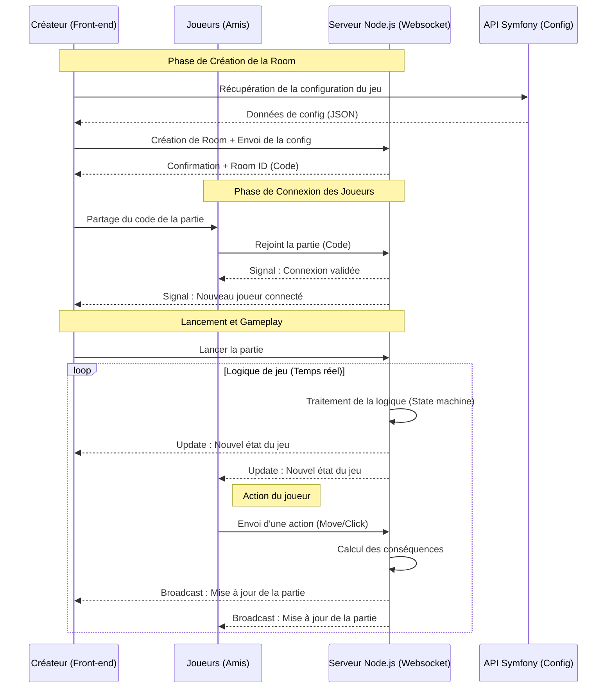

 
# Concept
il y a deux applications : 
- CARD Studio qui permet de créer des jeux de cartes personnalisés, en modifiant n’importe quel élément du jeu et/ou paramètre de la logique.
- Quant à CARD Games, il permet d’accueillir les joueurs ; ils arrivent sur une interface leur permettant de se connecter avec un code et ils rejoignent un menu leur demandant leur pseudo. Ils peuvent sinon choisir de créer une partie parmi plusieurs jeux publics proposés. Dans le cas où un utilisateur de CARD Studio a créé un jeu complet en privé, il obtiendra un code unique. Sur CARD Games, les joueurs pourront alors créer une partie à partir d’un code d’un jeu et non d’un jeu public.

# L'application
CARD Games est une interface web multijoueur qui permet de créer ou rejoindre facilement une partie de cartes. L’utilisateur peut soit entrer un code de room partagé par un hôte, soit choisir un jeu public dans le catalogue puis créer une room en renseignant son pseudo. L’application se connecte en WebSocket pour synchroniser en temps réel l’état de la partie (arrivée/départ des joueurs, mise à jour de la room, transitions de jeu) et inclut une salle d’attente avec partage du code et messagerie instantanée. L’architecture front-end est modulaire (pages, composants, contrôleurs), ce qui facilite l’intégration de nouveaux jeux et l’évolution des fonctionnalités.

# Stack technique 
- JavaScript (ES Modules) : langage principal du front-end et de la logique d’interface.
- HTML/CSS : structure des pages et styles des composants.
- Architecture modulaire : séparation en pages, composants, contrôleurs, routeur et helpers.
- WebSocket (Socket.IO côté client) : synchronisation en temps réel des rooms, joueurs et événements de partie.
- API HTTP : récupération des jeux disponibles et de leurs configurations.
- Outils de projet : Makefile pour les commandes de développement et tests JavaScript via tests.js.
# Architecture
 
## Organisation des dossiers

| Dossier | Rôle |
|---------|------|
| **pages/** | Pages principales de l'application (accueil, catalogue jeux, saisie code/pseudo, interface de jeu) |
| **components/** | Composants UI réutilisables (boutons, cartes, messages, salle d'attente) |
| **src/** | Cœur métier : routeur, WebSocket, contrôleurs et helpers |
| **src/router/** | Gère la navigation et le chargement des pages |
| **src/websocket/** | Connexion Socket.IO et gestion des événements temps réel |
| **src/controller/** | Logique métier des actions (parties, messages, joueurs) |
| **src/helpers/** | Fonctions utilitaires (copie de code, etc.) |
| **assets/** | Images et ressources statiques |

## Flux de communication

1. **Utilisateur clique** → **Router** décide quelle page afficher
2. **Page charge** → Utilise **Composants** et appelle **Controllers**
3. **Controller** → Émet des événements via **WebSocket** ou effectue appels **HTTP**
4. **Serveur WebSocket** → Retourne les mises à jour de partie
5. **Composants** → Se réactualisent avec les nouvelles données

# Connexion à un jeu

 

